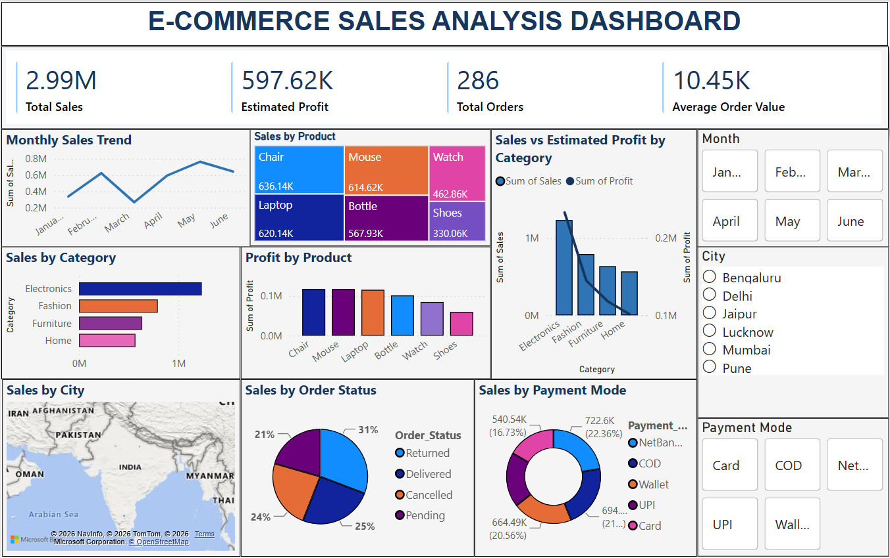

# E-Commerce Sales Analysis

An end-to-end E-Commerce Sales Analysis project using Python, SQL Server, and Power BI to clean, analyze, and visualize sales data and generate meaningful business insights.

##  Project Overview

This project analyzes an E-Commerce sales dataset to understand sales performance, product performance, customer behavior, order trends, payment methods, and business performance across different cities and categories.

The project follows an end-to-end Data Analyst workflow:

**Data Cleaning → Data Validation → SQL Analysis → Power BI Dashboard → Business Insights**

Python was used for data cleaning and preparation, SQL Server was used for business-oriented analysis, and Power BI was used to build an interactive dashboard with DAX measures, KPIs, and slicers.

##  Business Objectives

The main objectives of this project are to:

- Analyze overall sales performance
- Identify top-performing products and categories
- Analyze sales trends over time
- Compare sales across cities
- Understand order status distribution
- Analyze payment mode usage
- Identify high-performing and loss-making orders
- Analyze customer-level performance
- Create an interactive dashboard for business reporting

##  Tools & Technologies

- Python
- Pandas
- Matplotlib
- Seaborn
- Jupyter Notebook
- SQL
- SQL Server
- Power BI
- DAX
- GitHub

##  Project Workflow

### 1. Data Cleaning & Preparation — Python

Python and Pandas were used for:

- Data inspection
- Data type checking
- Text cleaning
- Date formatting
- Duplicate checking
- Missing-value identification
- Feature creation
- Outlier detection using IQR
- Data validation
- Exporting the cleaned dataset to CSV

The cleaned dataset was exported as `Clean_Ecommerce.csv` for further analysis.

### 2. Data Validation — Python

The dataset was validated using:

- `df.info()`
- `df.isna().sum()`
- `df.describe()`
- Shape and structure checks

Missing values were identified in some columns during the final validation stage.

Rather than removing all records during Python processing, the required missing-value filtering/handling was performed during the Power BI reporting stage.

### 3. SQL Analysis — SQL Server

SQL Server was used to perform business-oriented analysis.

The analysis includes:

- Total Orders
- Total Sales
- Top Products by Sales
- Top Cities by Sales
- Monthly Sales Performance
- Highest Estimated Profit Product
- Payment Mode Analysis
- Cancelled Orders
- Loss-Making Orders
- Top Customers by Estimated Profit

SQL concepts used include:

- SELECT
- WHERE
- GROUP BY
- ORDER BY
- Aggregate Functions
- SUM()
- COUNT()
- TOP
- Data Filtering
- Business-oriented SQL Analysis

### 4. Dashboard & Reporting — Power BI

Power BI was used to create an interactive E-Commerce Sales Analysis Dashboard.

The dashboard includes:

- KPI Cards
- Total Sales
- Estimated Profit
- Total Orders
- Average Order Value
- Monthly Sales Trend
- Sales by Product
- Sales by Category
- Estimated Profit by Product
- Sales vs Estimated Profit by Category
- Sales by City
- Sales by Order Status
- Sales by Payment Mode

DAX measures were used to calculate key business metrics and KPIs.

Interactive slicers were added for:

- Month
- City
- Payment Mode

##  Estimated Profit Assumption

The `Profit` field used in this project represents **Estimated Profit**, not actual reported business profit.

For analysis purposes:

**Estimated Profit = Net Amount × 20%**

Therefore, profit-related metrics and visuals should be interpreted as estimates based on the 20% assumption.

## 📷 Power BI Dashboard



##  Key Business Analysis Areas

### Sales Performance

- Overall sales performance
- Monthly sales trends
- Category-wise sales
- Product-wise sales

### Product Performance

- Top-selling products
- Estimated profit by product
- Loss-making orders

### Customer Analysis

- Customer-level estimated profit
- Identification of high-value customers

### Geographic Analysis

- City-wise sales performance

### Order Analysis

- Order status distribution
- Cancelled orders
- Total order volume

### Payment Analysis

- Payment mode usage
- Order distribution by payment method

##  Key Outcomes

This project demonstrates how raw E-Commerce data can be transformed into meaningful business insights through an end-to-end analytics workflow.

The analysis provides visibility into:

- Overall sales performance
- Product and category performance
- Monthly sales trends
- City-wise sales
- Order status
- Payment behavior
- Estimated profit performance
- Customer-level performance

##  Project Structure

```text
E-Commerce-Sales-Analysis/
│
├── Python/
│   ├── ECommerce_Data_Cleaning.ipynb
│   └── Clean_Ecommerce.csv
│
├── SQL/
│   └── ECommerce_SQL_Analysis.sql
│
├── PowerBI/
│   ├── ECommerce_Sales_Dashboard.pbix
│   └── Dashboard.png
│
└── README.md
```
##  Skills Demonstrated

**Data Analysis**
- Data Cleaning
- Data Validation
- Exploratory Data Analysis (EDA)
- Business Analysis
- KPI Analysis
- Data Visualization
- Outlier Detection
- Data Transformation

**Python**
- Python
- Pandas
- Matplotlib
- Seaborn
- Jupyter Notebook

**SQL & SQL Server**
- SQL
- SQL Server
- SELECT, WHERE, GROUP BY, ORDER BY
- Aggregate Functions
- SUM(), COUNT(), TOP
- Data Filtering
- Business-oriented SQL Analysis

**Power BI & DAX**
- Power BI Dashboard Development
- DAX
- DAX Measures
- KPI Creation
- Interactive Slicers
- Interactive Dashboard
- Business Reporting

**Tools**
- GitHub
- Jupyter Notebook
- SQL Server
- Power BI

##  Conclusion

This project demonstrates an end-to-end Data Analyst workflow, from data cleaning and validation to SQL-based analysis and interactive Power BI reporting.

It showcases the ability to use Python, SQL Server, Power BI, and DAX to transform raw E-Commerce data into meaningful business insights, KPIs, and interactive visualizations.

##  Author

**Abhinav Kamboj**
*Aspiring Data Analyst*

Python | SQL | SQL Server | Power BI | Data Analysis | Data Visualization
